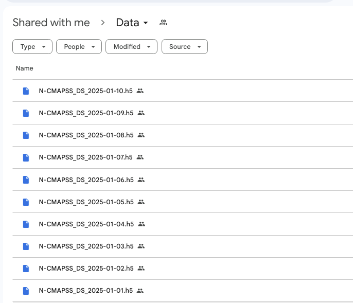
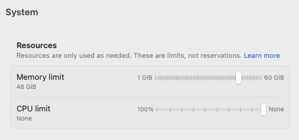
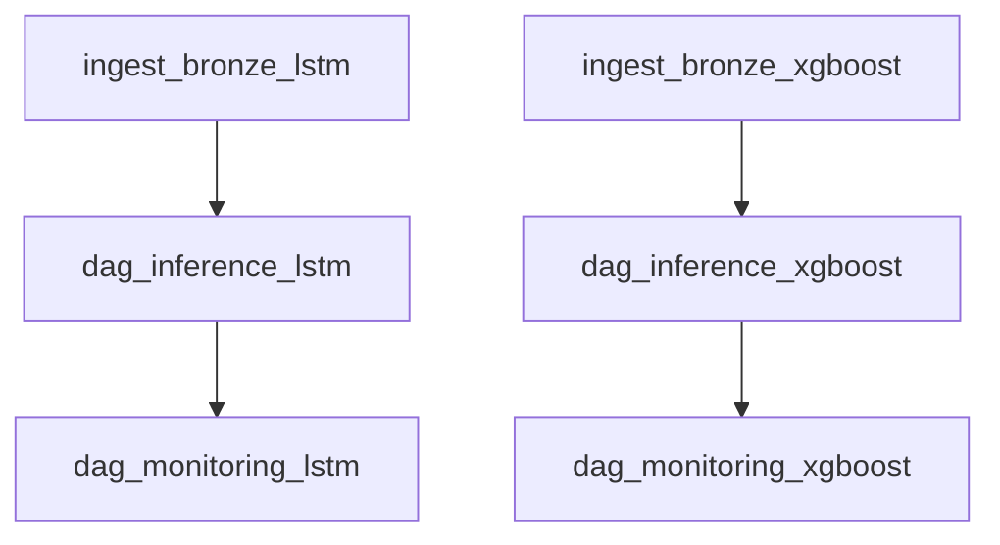

# Aircraft Engine Predictive Maintenance - N-CMAPSS Dataset

[](https://www.python.org/)
[](https://www.docker.com/)
[](https://airflow.apache.org/)

> Production-grade MLOps pipeline for predicting Remaining Useful Life (RUL) of aircraft engines using deep learning (LSTM) and gradient boosting (XGBoost) models.

---

## 📋 Overview

### What is This Project?

This system implements **Remaining Useful Life (RUL) prediction** for aircraft engines using NASA's N-CMAPSS dataset. Two machine learning approaches are compared:

1. **LSTM (Long Short-Term Memory)** - Deep learning with 30-cycle sequences
2. **XGBoost** - Gradient boosting with 96 engineered features

Note there are loom video 🎥 links provided throughout this README. Please consult them in case of confusion.

### Key Features

- ✅ **Production-Ready**: Apache Airflow orchestration, Docker containerization
- ✅ **Medallion Architecture**: Bronze → Silver → Gold data layers
- ✅ **Automated Pipelines**: 4-stage DAGs (Ingestion, Preprocessing, Training, Monitoring)
- ✅ **Model Monitoring**: Drift detection, performance tracking, automated reports
- ✅ **Scalable**: Spark for data processing, daily incremental updates

### System Requirements

| Component | Requirement |
|-----------|-------------|
| **OS** | Windows 10/11, Linux, macOS |
| **Docker** | Desktop 20.10+ |
| **RAM** | **48GB minimum** (see Docker Desktop settings) |
| **Storage** | 50GB free space |
| **GPU** | Optional: NVIDIA GPU with drivers (for LSTM acceleration) |

---

## 📥 Dataset Download

### Required Data Files

Download the N-CMAPSS dataset files from our Google Drive:

**🔗 [Download N-CMAPSS Dataset](https://drive.google.com/drive/folders/1dDBa8WWuScS_q2ws9KqyOlbV4fxx0Awp?usp=sharing)**

**🎥 [How to Download - Watch Loom](https://www.loom.com/share/c0f7a0e65e3647688681ed928af49b10)**

⚠️ **Note**: This shared drive will be available until **January 1, 2026**.



### What to Download

- **Files needed**: `N-CMAPSS_DS_2025-01-01.h5` through `N-CMAPSS_DS_2025-01-10.h5` (10 daily files)
- **Total size**: ~30GB
- **Destination**: Place all `.h5` files in `scripts/data/` directory

```bash
# Expected structure:
scripts/data/
├── N-CMAPSS_DS_2025-01-01.h5
├── N-CMAPSS_DS_2025-01-02.h5
├── N-CMAPSS_DS_2025-01-03.h5
├── N-CMAPSS_DS_2025-01-04.h5
├── N-CMAPSS_DS_2025-01-05.h5
├── N-CMAPSS_DS_2025-01-06.h5
├── N-CMAPSS_DS_2025-01-07.h5
├── N-CMAPSS_DS_2025-01-08.h5
├── N-CMAPSS_DS_2025-01-09.h5
└── N-CMAPSS_DS_2025-01-10.h5
```

### Data Split Information

The 10 daily files are organized for different purposes:

| Date Range | Files | Purpose | Description |
|------------|-------|---------|-------------|
| **2025-01-01 to 2025-01-05** | 5 files | **Train/Val/Test** | Model development and evaluation |
| **2025-01-06 to 2025-01-07** | 2 files | **OOT Set** | Out-of-Time validation (temporal holdout) |
| **2025-01-08 to 2025-01-10** | 3 files | **Production Inference** | Daily prediction pipeline |

**Notes:**

- **Train/Val/Test (Days 1-5)**: Used for initial model training, hyperparameter tuning, and evaluation
- **OOT Set (Days 6-7)**: Out-of-Time test set to validate model performance on unseen temporal data
- **Production Inference (Days 8-10)**: Simulates daily batch predictions in production environment

---

## 🤖 Pre-Trained Models

### Included Models

Pre-trained models are **already provided** in the `scripts/model_bank/` directory. You can use these models immediately without training.

```bash
scripts/model_bank/
├── darts_lstm_model.pkl            # Trained LSTM model (DARTS framework)
├── darts_lstm_model.pkl.ckpt       # LSTM model checkpoint
├── darts_target_scaler.pkl         # Target (RUL) scaler
├── darts_covariate_scaler.pkl      # Covariate (features) scaler
├── xgboost_rul_model.pkl           # Trained XGBoost model
├── feature_list.pkl                # XGBoost feature names
├── lstm_monitoring_baseline.json   # LSTM monitoring baseline metrics
└── xgboost_monitoring_baseline.json # XGBoost monitoring baseline metrics
```

### Using Pre-Trained Models (Recommended)

**No action needed!** The pipeline will automatically use the provided models for inference.

### Retraining from Scratch (Optional)

If you want to retrain the models:

1. **Delete or move the model files** you want to retrain.

2. **Enable training DAGs** in Airflow:
   - `train_lstm_model` - Trains LSTM model (~14 hours with GPU, longer without)
   - `train_xgboost_model` - Trains XGBoost model (~1 hour)

3. **Automatic detection**: The DAG tasks will automatically detect missing models and trigger training.

⚠️ **Note**: Training is computationally intensive. We recommend using the provided models unless you have specific customization needs.

---

## 🚀 Quick Start

**🎥 [How to Quick Start - Watch Loom](https://www.loom.com/share/8e5e48e174ae4860a3391725ec0fdc10)**

### 1. Prerequisites

- Docker Desktop installed and running with **48GB RAM allocated** (see image below)
- Raw data files downloaded and placed in `scripts/data/` (see Dataset Download section above)
- Pre-trained models are included in `scripts/model_bank/` (no action needed)

### 2. Configure Docker Memory

Before starting, ensure Docker Desktop has sufficient memory allocated:

1. Open **Docker Desktop** → **Settings** → **Resources**
2. Set **Memory limit** to **48 GiB** or higher
3. Click **Apply & Restart**



### 3. Start Pipeline

Choose the appropriate Docker Compose configuration based on your hardware:

#### Option A: CPU-Only (Default)

For systems without NVIDIA GPU or standard development:

```bash
# Start services (uses docker-compose.yaml)
docker-compose up -d

# Verify 3 containers running
docker ps

# Stop services when done
docker-compose down
```

**Uses these files:**

- `docker-compose.yaml` - Standard CPU configuration
- `Dockerfile` - Base Python image
- `requirements.txt` - Dependencies

#### Option B: GPU-Enabled (NVIDIA GPUs)

For systems with NVIDIA GPU and drivers installed (LSTM acceleration):

```bash
# Start services with GPU support (uses docker-compose.gpu.yaml)
docker-compose -f docker-compose.gpu.yaml up -d

# Verify 3 containers running with GPU access
docker ps

# Stop services when done
docker-compose -f docker-compose.gpu.yaml down
```

**Uses these files:**

- `docker-compose.gpu.yaml` - GPU-enabled configuration
- `Dockerfile.gpu` - NVIDIA CUDA base image with GPU support
- `requirements.gpu.txt` - Dependencies

**Note**: The `-f` flag specifies which compose file to use. GPU setup enables CUDA acceleration for LSTM training tasks, reducing training time significantly.

### 4. Access Airflow UI

- URL: **<http://localhost:8080>**
- Username: `admin` / Password: `admin`
- Enable DAGs based on your needs:

**Required DAGs (Inference with pre-trained models):**

- `ingest_bronze_lstm` - Data ingestion for LSTM
- `ingest_bronze_xgboost` - Data ingestion for XGBoost
- `dag_inference_lstm` - LSTM predictions
- `dag_inference_xgboost` - XGBoost predictions
- `dag_monitoring_lstm` - LSTM performance tracking
- `dag_monitoring_xgboost` - XGBoost performance tracking

**Optional DAGs (Model training):**

- `train_lstm_model` - Only if you deleted LSTM models to retrain
- `train_xgboost_model` - Only if you deleted XGBoost models to retrain

### 5. Monitor Progress

```powershell
ls scripts\datamart\bronze\n_cmapss\     # Bronze layer
ls scripts\datamart\inference\lstm\      # LSTM predictions
ls scripts\datamart\inference\xgboost\   # XGBoost predictions
```

**Runtime Estimates:**

- **Using pre-trained models** (recommended): 20-40 minutes (first run)
- **Training from scratch**: ~1 hour for XGBoost, ~14 hours for LSTM

---

## 🔄 Airflow DAGs Overview

This system uses **8 Airflow DAGs** to orchestrate the complete MLOps pipeline. Each DAG handles a specific stage of the workflow.

### DAG Configuration

All DAGs share a centralized configuration in `dags/dag_config.py`. You can modify these settings to control execution behavior:

**Key Settings:**

```python
SCHEDULE_INTERVAL = "0 0 * * *"      # Daily at midnight (cron format)
START_DATE = datetime(2025, 1, 8)    # When DAGs begin execution
END_DATE = datetime(2025, 1, 8)      # When DAGs stop execution
CATCHUP = True                        # Run missed DAG runs retroactively
```

**Common Adjustments:**

| Setting | Purpose | Example |
|---------|---------|---------|
| `START_DATE` | First date to process | `datetime(2025, 1, 8)` for Day 8 data |
| `END_DATE` | Last date to process | `datetime(2025, 1, 10)` for Day 8-10 data |
| `CATCHUP` | Process historical dates | `True` = run all dates, `False` = only latest |
| `SCHEDULE_INTERVAL` | Run frequency | `"0 0 * * *"` = daily at midnight |

**Example: Process all production days (8-10):**

```python
START_DATE = datetime(2025, 1, 8)
END_DATE = datetime(2025, 1, 10)
CATCHUP = True
```

After modifying `dag_config.py`, restart Airflow for changes to take effect:

```bash
docker-compose restart
```

---

### Data Ingestion DAGs

#### 1. `ingest_bronze_lstm` - LSTM Data Ingestion

**Purpose**: Converts raw H5 files to Parquet format (Bronze layer) for LSTM pipeline

**What it does**:

- Reads N-CMAPSS H5 files from `scripts/data/`
- Extracts sensor readings and operational settings
- Writes to Bronze layer: `scripts/datamart/bronze/n_cmapss/`

**Runtime**: 2-3 minutes per file

**🎥 [Watch DAG Walkthrough - Loom]()**

---

#### 2. `ingest_bronze_xgboost` - XGBoost Data Ingestion

**Purpose**: Converts raw H5 files to Parquet format (Bronze layer) for XGBoost pipeline

**What it does**:
- Reads N-CMAPSS H5 files from `scripts/data/`
- Extracts sensor readings and operational settings
- Writes to Bronze layer: `scripts/datamart/bronze/n_cmapss/`

**Runtime**: 2-3 minutes per file

**🎥 [Watch DAG Walkthrough - Loom]()**

---

### Preprocessing DAGs

These DAGs are embedded in the inference workflows (not standalone DAGs).

---

### Training DAGs (Optional)

#### 3. `train_lstm_model` - LSTM Model Training

**Purpose**: Trains LSTM model from scratch using DARTS framework

**What it does**:
- Loads data from Gold layer: `scripts/datamart/gold/lstm/`
- Trains LSTM model with 30-cycle sequences
- Saves model artifacts to `scripts/model_bank/`
  - `darts_lstm_model.pkl`
  - `darts_target_scaler.pkl`
  - `darts_covariate_scaler.pkl`

**Runtime**: ~14 hours with GPU (longer without)

**When to run**: Only if you deleted LSTM models to retrain

**🎥 [Watch DAG Walkthrough - Loom]()**

---

#### 4. `train_xgboost_model` - XGBoost Model Training

**Purpose**: Trains XGBoost model from scratch

**What it does**:
- Loads data from Gold layer: `scripts/datamart/gold/xgboost/`
- Trains XGBoost model with 96 engineered features
- Saves model artifacts to `scripts/model_bank/`
  - `xgboost_rul_model.pkl`
  - `feature_list.pkl`

**Runtime**: ~1 hour

**When to run**: Only if you deleted XGBoost models to retrain

**🎥 [Watch DAG Walkthrough - Loom]()**

---

### Inference DAGs (Required)

#### 5. `dag_inference_lstm` - LSTM Predictions

**Purpose**: Generates RUL predictions using pre-trained LSTM model

**What it does**:
- Loads pre-trained LSTM model from `scripts/model_bank/`
- Preprocesses data (Bronze → Silver → Gold)
- Runs batch inference on production data (Days 8-10)
- Writes predictions to: `scripts/datamart/inference/lstm/`

**Runtime**: 10-20 minutes

**🎥 [Watch DAG Walkthrough - Loom]()**

---

#### 6. `dag_inference_xgboost` - XGBoost Predictions

**Purpose**: Generates RUL predictions using pre-trained XGBoost model

**What it does**:
- Loads pre-trained XGBoost model from `scripts/model_bank/`
- Preprocesses data (Bronze → Silver → Gold)
- Runs batch inference on production data (Days 8-10)
- Writes predictions to: `scripts/datamart/inference/xgboost/`

**Runtime**: 10-20 minutes

**🎥 [Watch DAG Walkthrough - Loom]()**

---

### Monitoring DAGs (Required)

#### 7. `dag_monitoring_lstm` - LSTM Performance Tracking

**Purpose**: Monitors LSTM model performance and detects data drift

**What it does**:
- Loads inference results from `scripts/datamart/inference/lstm/`
- Calculates performance metrics (RMSE, MAE, etc.)
- Detects feature drift and prediction drift
- Compares against baseline: `scripts/model_bank/lstm_monitoring_baseline.json`
- Generates monitoring reports

**Runtime**: 1-2 minutes

**🎥 [Watch DAG Walkthrough - Loom]()**

---

#### 8. `dag_monitoring_xgboost` - XGBoost Performance Tracking

**Purpose**: Monitors XGBoost model performance and detects data drift

**What it does**:
- Loads inference results from `scripts/datamart/inference/xgboost/`
- Calculates performance metrics (RMSE, MAE, etc.)
- Detects feature drift and prediction drift
- Compares against baseline: `scripts/model_bank/xgboost_monitoring_baseline.json`
- Generates monitoring reports

**Runtime**: 1-2 minutes

**🎥 [Watch DAG Walkthrough - Loom]()**

---

### DAG Execution Order

For a typical production run with pre-trained models:



**Recommended execution sequence:**

1. Enable and run `ingest_bronze_lstm` and `ingest_bronze_xgboost` in parallel
2. Once ingestion completes, run `dag_inference_lstm` and `dag_inference_xgboost` in parallel
3. Once inference completes, run `dag_monitoring_lstm` and `dag_monitoring_xgboost` in parallel

---

## 📐 Architecture

For complete system architecture, see **[ARCHITECTURE.md](ARCHITECTURE.md)**

### High-Level Flow

```
Raw H5 → Bronze (Parquet) → Silver (Cleaned) → Gold (Features+Labels)
    ├─→ LSTM (12 sensors, TimeSeries) → Inference → Monitoring
    └─→ XGBoost (96 features) → Inference → Monitoring
```

### Pipeline Stages

| Stage | Purpose | Runtime/Day | Notes |
|-------|---------|-------------|-------|
| **1. Ingestion** | H5 → Parquet | 2-3 min | Required |
| **2. Preprocessing** | Clean & Feature Engineering | 10-15 min | Required |
| **3. Training** | Model Training | 14 hours (GPU) | Optional (pre-trained models provided) |
| **4. Inference** | Model Predictions | 10-20 min | Required |
| **5. Monitoring** | Performance Tracking | 1-2 min | Required |

---

## 📁 Project Structure

### Core Infrastructure

```
MLE Proj LSTM/
├── docker-compose.yaml         # CPU-only orchestration config
├── docker-compose.gpu.yaml     # GPU-enabled orchestration config
├── Dockerfile                  # CPU-only container image
├── Dockerfile.gpu              # GPU-enabled container image
├── dags/                       # Airflow DAG definitions (8 files)
│   ├── dag_inference_lstm.py
│   ├── dag_inference_xgboost.py
│   ├── dag_monitoring_lstm.py
│   ├── dag_monitoring_xgboost.py
│   └── ... (shared DAGs)
└── docs/                       # Documentation
```

### Data & Models

```
scripts/
├── data/                       # Raw H5 files (~30GB)
│   ├── N-CMAPSS_DS_2025-01-01.h5
│   ├── N-CMAPSS_DS_2025-01-02.h5
│   └── ... (through 2025-01-10)
├── datamart/                   # Medallion architecture (~50GB)
│   ├── bronze/n_cmapss/        # Raw parquet (shared)
│   ├── silver/n_cmapss/        # Cleaned data (shared)
│   ├── gold/
│   │   ├── lstm/               # LSTM features & labels
│   │   └── xgboost/            # XGBoost features & labels
│   └── inference/
│       ├── lstm/               # LSTM predictions
│       └── xgboost/            # XGBoost predictions
└── model_bank/                 # Trained models & scalers
    ├── darts_lstm_model.pkl            # LSTM model
    ├── darts_lstm_model.pkl.ckpt       # LSTM checkpoint
    ├── darts_target_scaler.pkl         # RUL scaler
    ├── darts_covariate_scaler.pkl      # Feature scaler
    ├── xgboost_rul_model.pkl           # XGBoost model
    ├── feature_list.pkl                # XGBoost features
    ├── lstm_monitoring_baseline.json   # LSTM baseline
    └── xgboost_monitoring_baseline.json # XGBoost baseline
```

### LSTM Pipeline

```
scripts/lstm/
├── 00_bronze_ingestion.py      # H5 → Parquet conversion
├── 01_silver_preprocessing.py  # Data cleaning
├── 02_gold_feature_label.py    # Sequence creation (30 cycles)
├── 03_model_training.py        # LSTM training (GPU-accelerated)
├── 04_model_inference.py       # Batch prediction
└── 05_model_monitoring.py      # Drift detection & metrics
```

### XGBoost Pipeline

```
scripts/xgboost/
├── 00_bronze_ingestion.py      # H5 → Parquet conversion
├── 01_silver_preprocessing.py  # Data cleaning
├── 02_gold_feature_label.py    # Feature engineering (96 features)
├── 03_model_training.py        # XGBoost training (CPU)
├── 04_model_inference.py       # Batch prediction
└── 05_model_monitoring.py      # Drift detection & metrics
```

### Key Differences Between Models

| Component | LSTM | XGBoost |
|-----------|------|---------|
| **Input** | 12 sensors × 30 timesteps | 96 engineered features |
| **Training** | GPU-accelerated (2-4 hours) | CPU-only (15-30 min) |
| **Feature Engineering** | Minimal (sequences only) | Extensive (rolling stats, lags) |
| **Model Format** | `.pkl` (DARTS framework) | `.pkl` (pickle) |
| **Best For** | Temporal patterns | Feature interactions |

---

## 📊 Model Performance

| Model | Features | RMSE | MAE | Training Time |
|-------|----------|------|-----|---------------|
| **LSTM** | 12 sensors, 30-cycle sequences | 0.10-0.15 | 0.03-0.05 | 14 hours (GPU) |
| **XGBoost** | 96 engineered features | 18.2091 | 14.6529 | 15-30 min (CPU) |

---

## 🛠️ Troubleshooting

### Port 8080 Already in Use

```powershell
netstat -ano | findstr :8080
taskkill /PID <process_id> /F
docker-compose up -d
```

### Memory Error

1. Docker Desktop → Settings → Resources → Memory: **48GB minimum** (see [Docker Memory Settings](#2-configure-docker-memory))
2. Restart Docker
3. Clear failed tasks:

   ```bash
   docker exec mle-202508-team-awesome-tango-airflow-scheduler-1 airflow tasks clear <dag_id> --yes --only-failed
   ```

### Files Not Appearing

Ensure Docker has file sharing enabled for project directory.

### View Logs

```bash
docker logs mle-202508-team-awesome-tango-airflow-scheduler-1 --follow
```

For more issues, see full [README.md](README.md) Troubleshooting section.

---

## 📚 Documentation

| Document | Description |
|----------|-------------|
| **README.md** | Project overview (original, comprehensive) |
| **ARCHITECTURE.md** | Complete system design and specifications |
| **docs/** | Detailed guides and methodologies |

---

## 👥 Team

**MITB Project Team**:

1. CHEN Tiancheng
2. CHEN Zhiyang
3. LIN Xiongqing
4. Justin NG
5. SIM Kim Sia

---

## 📄 License

MIT License - See LICENSE file for details.

---

**Last Updated**: 6 Nov 2025
**Version**: 2.0 (Production MLOps Pipeline)

**Happy Predicting! 🚀✈️**
