# LSTM Sequencing, RUL Clipping, and Normalization Explained

This document walks through the preprocessing pipeline that prepares the N-CMAPSS turbofan degradation data for the LSTM model built in the notebook. It focuses on three tightly coupled steps:

1. **Smoothing and normalization of sensor features** ("healthy baseline" scaling).
2. **Remaining Useful Life (RUL) clipping** to focus the target variable on the degradation regime.
3. **Sliding-window sequencing** that shapes the data into the 3D tensors expected by the LSTM.

---

## 1. Starting point: EMA-smoothed features

After selecting the key sensors, the notebook computes an *Exponential Moving Average (EMA)* per engine unit:

$$\text{EMA}_{t} = \alpha \cdot x_t + (1-\alpha) \cdot \text{EMA}_{t-1}, \quad \alpha = \frac{2}{\text{span}+1}$$

- `span` = 10 in the notebook.
- EMA is computed separately for each engine, preserving temporal structure.
- The result is a smoother series that de-emphasizes short-term noise but retains trend information that signals degradation.

The EMA columns form the basis for the normalization described next.

---

## 2. Healthy-baseline normalization

**Goal:** express each sensor as "how far has it drifted from healthy behavior?" on a 0–1 scale.

### 2.1 Reference points from train split only

For each EMA feature (e.g., `Fan Speed_EMA`):

1. **Baseline (`min`)**: mean EMA value during the first 20 cycles of every training engine (`HEALTHY_WINDOW = 20`). This approximates nominal performance before degradation starts.
2. **Peak (`max`)**: global maximum EMA value observed on the training engines.

These values are stored in `norm_params` and reused for validation, internal test, and out-of-time (OOT) data, keeping the scaling consistent with what the model saw during training.

### 2.2 Scaling formula

For each observation and each EMA column:

$$
\text{Norm} = \frac{\text{EMA} - \text{baseline}}{\text{max} - \text{baseline}}
$$

- Values are clipped to `[0, 1]` so anything below baseline becomes 0 and anything beyond the training maximum becomes 1.
- When `max == baseline` (no variation in training), the code safely assigns 0 to avoid division-by-zero.

**Intuition:** the normalized value measures relative health deterioration:

- 0 → engine operating like it did in the healthy window.
- 1 → engine exhibiting the worst deviation seen in training.

This normalized matrix (columns ending with `_NORM`) feeds the LSTM.

---

## 3. RUL clipping (target engineering)

The raw RUL target counts down from large numbers (hundreds of cycles) to zero. Very large RUL values correspond to healthy periods that offer little predictive signal. The notebook clips RUL at 125 cycles:

$$
\text{RUL\_clipped} = \min(\text{RUL\_raw}, 125)
$$

### Why clip?

1. **Focus on degradation regime**: The LSTM learns patterns that matter when the engine is closer to failure. High RUL regions are relatively flat and easy to predict, but they dominate the loss without clipping.
2. **Better gradient scaling**: Smaller target values reduce the range the model must cover, helping gradients stay well behaved.
3. **Industry convention**: Many prognostics benchmarks (including CMAPSS variants) clip between 125–130 cycles for the same reasons.

A timeline illustration:

```text
Raw RUL:    200 198 196 ... 130 128 126 124 122 ...  10  8  6  4  2  0
Clipped RUL:125 125 125 ... 125 125 125 124 122 ...  10  8  6  4  2  0
```

- The early region is flattened at 125.
- Once the true RUL dips below 125, the clipped value tracks it exactly.

This clipped vector becomes the target used during sequencing.

---

## 4. Sliding-window sequencing for the LSTM

### 4.1 What the LSTM expects

PyTorch LSTMs consume tensors shaped like `(batch_size, sequence_length, num_features)`. Each row in the batch is a time window (sequence) with a fixed number of timesteps.

In the notebook:

- `sequence_length = 30`
- `num_features = len(NORM_FEATURES)` (normalized sensor columns)

### 4.2 Sliding window mechanics

For each engine unit, the function `create_sequences` performs:

1. Extract the normalized feature matrix `feature_data` (shape `(T_i, F)` where `T_i` is the number of cycles for unit `i`).
2. Extract the clipped RUL vector `target_data` (shape `(T_i, 1)`).
3. Slide a window of length `sequence_length` across the timeline. For every start index `s`:
   - **Input sequence**: `feature_data[s : s + 30]` → shape `(30, F)`.
   - **Target label**: `target_data[s + 30 - 1]` → the RUL corresponding to the final timestep.
4. Append the input sequence and label to lists `X` and `y`.

### 4.3 Visual timeline

```mermaid
gantt
dateFormat  X
title 30-step window centered on cycle t
section Engine Unit DSXX_YYY
History up to t-29   :done,    0,    29
Window [t-29 .. t]   :active, 29,   30
Future (ignored)     :        59,   15
```



- The highlighted window is the data fed to the LSTM.
- The label is the clipped RUL at cycle `t` (the window’s end).

Alternatively, in ASCII form:

```text
Cycle index:    ...  t-29  t-28  ...   t-2   t-1    t    t+1  ...
Features used:        [------------- 30 steps -------------]
Target RUL:                                               ^
                                                          |
                                              RUL_Clipped at time t
```

### 4.4 Dataset independence

Sequencing is performed separately for each engine to avoid mixing temporal patterns across units. After processing all units, the sequences are stacked into arrays:

- `X_train` shape → `(N_train_seq, 30, F)`
- `y_train` shape → `(N_train_seq,)`

These arrays are wrapped into a `TimeSeriesDataset` so PyTorch can batch them during training.

---

## 5. End-to-end dataflow summary

```mermaid
flowchart TD
    subgraph Raw Data
        A[HDF5: W, X_s, X_v, Y, A]
    end
    B[Combine datasets & rename columns]
    C[Select features & compute EMA per engine]
    D[Healthy-window stats (train split)]
    E[Normalize EMA -> *_NORM]
    F[Clip RUL at 125 -> RUL_Clipped]
    G[create_sequences() per engine]
    H[LSTM-ready tensors]

    A --> B --> C --> D --> E --> F --> G --> H
```

- **Nodes A–C**: produce smoothed sensor features.
- **D–E**: compute healthy baselines and scale features.
- **F**: cap RUL.
- **G**: slice the data into sequences with aligned targets.
- **H**: feeds the `TimeSeriesDataset` used by the `DataLoader`.

---

## 6. Key takeaways

- Normalization is *contextual*: it compares the current sensor behavior against how healthy engines behaved in their early life, and the scaling parameters are learned exclusively from the training set.
- RUL clipping keeps the learning objective concentrated on the regime where accurate predictions matter most and stabilizes optimization.
- The sliding-window sequencing respects temporal order, uses the latest timestep as the predictive target, and builds the exact tensor structure required by the LSTM.

Reviewing the `normalize_and_clip_rul` and `create_sequences` functions alongside this document should now provide a complete picture of how the dataset is transformed before training the model.
